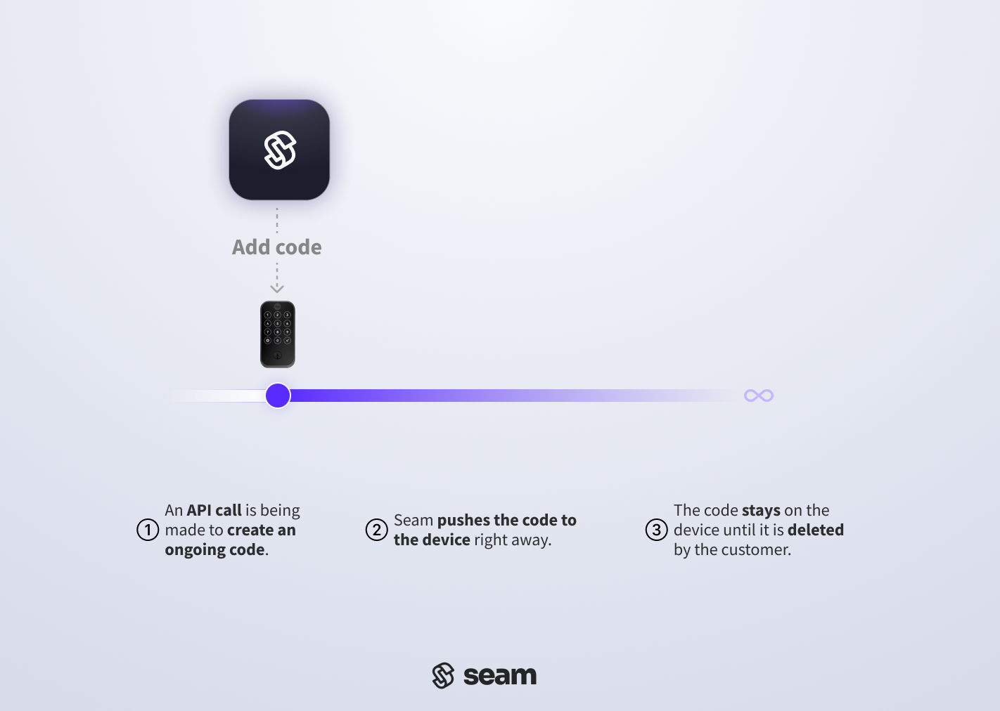

# Creating Access Codes

## Overview

This guide explains how to create access codes on a smart lock. With the [Access Codes](../../../api-clients/access-codes/) API, generate PIN codes on a door lock and share it with visitors, allowing them keyless access.

Seam supports programming two types of access codes:

1. **Ongoing**: Ideal for residents or long-term users. Ongoing codes remain active on a device until removed. Create one by leaving the `end_at` field empty. To remove the code, use the [Delete Access Code](../../../api-clients/access-codes/delete-an-access-code.md) endpoint.
2. **Time Bound**: Suitable for temporary access like guest visits or service appointments. These codes operate between a designated `starts_at` and `ends_at` time window, granting access only during that period.

***

## Before You Begin

To confirm that Seam supports access code programming for your device, use [Get Device](../../../api-clients/devices/get-device.md) or [Get Lock](../../../api-clients/locks/get-lock.md) to query the device and check its `capabilities_supported` property. Ensure that the `capabilities_supported` list includes `access_code`.



**Request:**

```python
pprint(seam.locks.get(device="6aae9d08-fed6-4ca5-8328-e36849ab48fe"))
```

**Response:**

```
Device(device_id='6aae9d08-fed6-4ca5-8328-e36849ab48fe',
       .
       .
       .
       capabilities_supported=[
              'access_code', // Device supports access code actions.
              .
              .
              .
              ],
       .
       .
       .
       )
```



**Request:**

```bash
curl -X 'POST' \
  'https://connect.getseam.com/devices/get' \
  -H 'accept: application/json' \
  -H 'Authorization: Bearer ${API_KEY}' \
  -H 'Content-Type: application/json' \
  -d '{
  "device_id": "6aae9d08-fed6-4ca5-8328-e36849ab48fe"
}'
```

**Response:**

```json
{
  "device": {
    "device_id": "6aae9d08-fed6-4ca5-8328-e36849ab48fe",
    .
    .
    .
    "capabilities_supported": [
      "access_code", // Device supports access code actions.
      .
      .
      .
    ],
    .
    .
    .
  },
  .
  .
  .
}
```



**Request:**

```javascript
console.log(await seam.locks.get("6aae9d08-fed6-4ca5-8328-e36849ab48fe"))
```

**Response:**

```json
{
  device_id: '6aae9d08-fed6-4ca5-8328-e36849ab48fe',
  .
  .
  .
  capabilities_supported: [
    'access_code', // Device supports access code actions.
    .
    .
    .
    ],
  .
  .
  .
}
```



**Request:**

```ruby
puts client.locks.get("6aae9d08-fed6-4ca5-8328-e36849ab48fe").inspect
```

**Response:**

```
<Seam::Device:0x00438
  device_id="6aae9d08-fed6-4ca5-8328-e36849ab48fe"
  .
  .
  .
  capabilities_supported=[
    "access_code", // Device supports access code actions.
    .
    .
    .
    ]
  .
  .
  .
  >
```



**Request:**

```php
$device = $seam->devices->get("6aae9d08-fed6-4ca5-8328-e36849ab48fe");
echo json_encode($device->capabilities_supported, JSON_PRETTY_PRINT);
```

**Response:**

```
[
    "access_code", // Device supports access code actions.
    .
    .
    .
]
```



**Request:**

```csharp
var device = seam.Devices.Get("6aae9d08-fed6-4ca5-8328-e36849ab48fe");
  Console.WriteLine("Device ID: " + device.DeviceId);
  Console.WriteLine("Capabilities:");
  foreach (var capability in device.CapabilitiesSupported)
  {
    Console.WriteLine(capability);
  }
```

**Response:**

```
Device ID: 6aae9d08-fed6-4ca5-8328-e36849ab48fe
Capabilities:
AccessCode // Device supports access code actions.
.
.
.
```



**Request:**

```java
Device lock = seam.locks()
        .get(LocksGetRequest.builder()
                .deviceId("6aae9d08-fed6-4ca5-8328-e36849ab48fe")
                .build());
System.out.println(lock);
```

**Response:**

```json
{
  "device_id" : "6aae9d08-fed6-4ca5-8328-e36849ab48fe",
  .
  .
  .
  "capabilities_supported" : [ 
    "access_code", // Device supports access code actions.
    .
    .
    .
  ],
  .
  .
  .
}
```



***

## Programming an Ongoing Code

Ongoing Access codes are ideal for long-term users that wish to keep the same code. Ongoing codes remain active on a device until removed.

<figure><figcaption><p>Timeline of an ongoing access code. The code will remain active until you ask Seam to remove it.</p></figcaption></figure>

### 1. Create an Ongoing Access Code

Set an ongoing code by providing the `device_id` of the smart lock on which you want to [create an access code](../../../api-clients/access-codes/create-an-access-code.md). Assign an optional `name` to the access code for easier identification within the [Seam Console](https://console.seam.co) and smart lock app.

To customize the PIN code, specify a desired PIN for the `code` property. Refer to [the guide on access code requirements](access-code-requirements-for-door-locks.md) to understand any requirements specific to the door lock.



**Request:**

```python
device_id = "6aae9d08-fed6-4ca5-8328-e36849ab48fe"

created_access_code = seam.access_codes.create(
  device = device_id,
  name = "my ongoing code",
  code = "1234"
)

pprint(created_access_code)
```

**Response:**

```
AccessCode(access_code_id='daf89de3-ad3a-49aa-93bd-25f27d58f699',
           device_id='6aae9d08-fed6-4ca5-8328-e36849ab48fe',
           type='ongoing',
           code='1234',
           created_at='2023-10-19T02:15:04.911Z',
           errors=[],
           warnings=[],
           starts_at=None,
           ends_at=None,
           name='my ongoing code',
           status='setting',
           common_code_key=None,
           is_managed=True,
           is_waiting_for_code_assignment=None,
           is_scheduled_on_device=None,
           pulled_backup_access_code_id=None,
           is_backup_access_code_available=False,
           is_backup=None,
           appearance=None,
           is_external_modification_allowed=False,
           is_offline_access_code=False,
           is_one_time_use=False)
```



**Request:**

```bash
curl -X 'POST' \
  'https://connect.getseam.com/access_codes/create' \
  -H 'accept: application/json' \
  -H 'Authorization: Bearer ${API_KEY}' \
  -H 'Content-Type: application/json' \
  -d '{
  "device_id": "6aae9d08-fed6-4ca5-8328-e36849ab48fe",
  "name": "my ongoing code",
  "code": "1234"
}'
```

**Response:**

```json
{
  "action_attempt": {
    "status": "pending",
    "action_type": "CREATE_ACCESS_CODE",
    "action_attempt_id": "e8efa128-c06d-40c3-8def-dbb25e5231df",
    "result": null,
    "error": null
  },
  "access_code": {
    "access_code_id": "d2047ba8-8849-467f-a07a-efab6c3673bc",
    "device_id": "6aae9d08-fed6-4ca5-8328-e36849ab48fe",
    "name": "my ongoing code",
    "appearance": null,
    "code": "1234",
    "common_code_key": null,
    "type": "ongoing",
    "status": "setting",
    "pulled_backup_access_code_id": null,
    "is_backup_access_code_available": true,
    "created_at": "2023-10-19T06:55:28.278Z",
    "errors": [],
    "warnings": [],
    "is_managed": true,
    "is_external_modification_allowed": false,
    "is_offline_access_code": false,
    "is_one_time_use": false
  },
  "ok": true
}
```



**Request:**

```javascript
const deviceId = "6aae9d08-fed6-4ca5-8328-e36849ab48fe"

const createdAccessCode = await seam.accessCodes.create({
    device_id: deviceId,
    name: "my ongoing code",
    code: "1234"
})
  
console.log(createdAccessCode)
```

**Response:**

```json
{
  access_code_id: 'f4780806-076e-4cec-8081-df0ea2139d5a',
  device_id: '6aae9d08-fed6-4ca5-8328-e36849ab48fe',
  name: 'my ongoing code',
  appearance: null,
  code: '1234',
  common_code_key: null,
  type: 'ongoing',
  status: 'setting',
  pulled_backup_access_code_id: null,
  is_backup_access_code_available: true,
  created_at: '2023-10-19T09:30:58.399Z',
  errors: [],
  warnings: [],
  is_managed: true,
  is_external_modification_allowed: false,
  is_offline_access_code: false,
  is_one_time_use: false
}
```



**Request:**

```ruby
device_id = "6aae9d08-fed6-4ca5-8328-e36849ab48fe"

created_access_code = client.access_codes.create(
  device_id: device_id,
  name: "my ongoing code",
  code: "1234"
)

puts created_access_code.inspect
```

**Response:**

```
<Seam::AccessCode:0x00460
  code="1234"
  name="my ongoing code"
  type="ongoing"
  errors=[]
  status="setting"
  warnings=[]
  device_id="6aae9d08-fed6-4ca5-8328-e36849ab48fe"
  appearance=nil
  created_at=2023-10-23 20:49:42.932 UTC
  is_managed=true
  access_code_id="6fe348a8-5938-4b73-8a36-86f7ffdfc431"
  pulled_backup_access_code_id=nil
  is_backup_access_code_available=true
  is_external_modification_allowed=false
  is_offline_access_code=false
  is_one_time_use=false>
```



```php
$seam = new SeamClient("YOUR_API_KEY");

$device_id = "0e2e6262-7f91-4970-a58d-47ef30b41e2e";

$access_code = $seam->access_codes->create(
  device_id: $device_id,
  name: 'my ongoing code',
);

# Inspect this created code
echo json_encode($access_code, JSON_PRETTY_PRINT);

// {
//     "access_code_id": "bd7e8681-4df6-437c-a12a-e965ecca9caf",
//     "device_id": "0e2e6262-7f91-4970-a58d-47ef30b41e2e",
//     "name": "my ongoing code",
//     "type": "ongoing",
//     "status": "setting",
//     "starts_at": null,
//     "ends_at": null,
//     "code": "453419",
//     "created_at": "2023-09-04T05:29:08.084Z",
//     "errors": [],
//     "warnings": [],
//     "is_managed": true,
//     "common_code_key": null,
//     "is_waiting_for_code_assignment": null
// }
```



**Request:**

```csharp
var deviceId = "6aae9d08-fed6-4ca5-8328-e36849ab48fe";
var createdAccessCode = seam.AccessCodes.Create(
  deviceId: deviceId,
  name: "my ongoing code",
  code: "1234"
);

Console.WriteLine("Created access code ID: " + createdAccessCode.AccessCodeId);
```

**Response:**

```
Created access code ID: fe372cb9-1fa5-492f-9494-ea01c5558333
```



**Request:**

```java
var deviceId = "6aae9d08-fed6-4ca5-8328-e36849ab48fe";

AccessCode CreatedAccessCode = seam.accessCodes().create(AccessCodesCreateRequest.builder()
        .deviceId(deviceId)
        .name("my ongoing code")
        .code("1234")
        .build());
System.out.println(CreatedAccessCode);
```

**Response:**

```json
{
  "type" : "ongoing",
  "access_code_id" : "aff0c858-22f6-4587-9aac-1f5d550be560",
  "device_id" : "6aae9d08-fed6-4ca5-8328-e36849ab48fe",
  "name" : "my ongoing code",
  "code" : "1234",
  "created_at" : "2023-10-30T03:43:13.403Z",
  "errors" : [ ],
  "warnings" : [ ],
  "is_managed" : "true",
  "status" : "setting",
  "is_backup_access_code_available" : false,
  "is_offline_access_code" : false,
  "is_one_time_use" : false
}
```



### 2. Verify Successful Ongoing Code Programming

Seam may encounter some problems when setting an access code onto the lock. This could be due to weak internet connectivity, a low battery in the door lock, or someone unplugging the bridge that links the lock to the internet. **Given these potential challenges, it's essential to verify that a code has been successfully programmed on to the lock** to prevent unexpected complications later.

There are two methods to verify that an ongoing access code has been set on the device:

* **Polling**: continuously query the access code until its `status` is updated
* **Webhook**: wait for updates to arrive via webhook requests from the Seam API

### **Polling Method**

Use the `access_code` reference returned by the create function to call the [Get Access Code](../../../api-clients/access-codes/get-an-access-code.md) function. A basic implementation would involve polling this endpoint until the `status` of the access code updates to `set`.

If the `status` remains `setting` for a very long time, or if the `access_code` object contains any `warnings` or `errors` properties, consult [the guide on "Troubleshooting Access Code Issues"](troubleshooting-access-code-issues.md) for further guidance.

<figure><figcaption><p>Illustration of the polling verification step for an ongoing access code</p></figcaption></figure>

### **Webhook Events Method**

To avoid polling, monitor for incoming Seam webhook events related to the code status:

* The `access_code.set_on_device` event indicates the successful setting of the access code on the device.
* The `access_code.failed_to_set_on_device` or `access_code.delay_in_setting_on_device` events indicate a delay or failure.

In the event of delay or failure, refer to [the "Troubleshooting access code issues" guide](troubleshooting-access-code-issues.md) for assistance and mitigation strategies.

<figure><figcaption><p>Illustration of the webhook verification method for an ongoing access code</p></figcaption></figure>

***

## Scheduling Time-Bound Access Codes

Time-bound access codes are suitable for temporary access, like guest visits or service appointments. These codes operate between designated `starts_at` and `ends_at` timestamps, granting access only during that period. Seam automatically ensures that the code is programmed on the device at the `starts_at` time and unprogrammed at the `ends_at` time.

<figure><figcaption><p>Timeline of an time-bound access code. The code will remain active until the ends_at timestamp you provide Seam.</p></figcaption></figure>

### 1. Create a Time-Bound Access Code

To set a time-bound code, provide the `device_id` of the smart lock on which you want to program a code, along with `starts_at` and `ends_at` [ISO 8601](https://www.iso.org/iso-8601-date-and-time-format.html) timestamps to define the active time window for the code. For more details, see the [Create Access Code endpoint](../../../api-clients/access-codes/create-an-access-code.md).

As with ongoing codes, you can assign an optional `name` to the access code. A clear name helps users to identify the access code quickly within their smart lock app.

Similarly, to customize the PIN code, specify a desired PIN in the `code` property. See the [guide on access code requirements](access-code-requirements-for-door-locks.md) to understand any requirements specific to the door lock brand.



**Request:**

```python
device_id = "6aae9d08-fed6-4ca5-8328-e36849ab48fe"

created_access_code = seam.access_codes.create(
  device = device_id,
  name = "my time-bound code",
  starts_at = "2025-01-01T16:00:00Z",
  ends_at = "2025-01-22T12:00:00Z",
  code = "2345"
)

pprint(created_access_code)
```

**Response:**

```
AccessCode(access_code_id='1bbd1eba-e4a2-4f96-b1b9-8498a5405b2b',
           device_id='6aae9d08-fed6-4ca5-8328-e36849ab48fe',
           type='time_bound',
           code='2345',
           created_at='2023-10-19T02:21:58.738Z',
           errors=[],
           warnings=[],
           starts_at='2025-01-01T16:00:00.000Z',
           ends_at='2025-01-22T12:00:00.000Z',
           name='my time-bound code',
           status='unset',
           common_code_key=None,
           is_managed=True,
           is_waiting_for_code_assignment=None,
           is_scheduled_on_device=False,
           pulled_backup_access_code_id=None,
           is_backup_access_code_available=False,
           is_backup=None,
           appearance=None,
           is_external_modification_allowed=False)
```



### Request:

```sh
curl -X 'POST' \
  'https://connect.getseam.com/access_codes/create' \
  -H 'accept: application/json' \
  -H 'Authorization: Bearer ${API_KEY}' \
  -H 'Content-Type: application/json' \
  -d '{
  "device_id": "6aae9d08-fed6-4ca5-8328-e36849ab48fe",
  "name": "my time-bound code",
  "starts_at": "2025-01-01T16:00:00Z",
  "ends_at": "2025-01-22T12:00:00Z",
  "code": "2345"
}'
```

### Response:

```json
{
  "action_attempt": {
    "status": "pending",
    "action_type": "CREATE_ACCESS_CODE",
    "action_attempt_id": "2fa34934-883b-496c-8ec1-ac023de55f5a",
    "result": null,
    "error": null
  },
  "access_code": {
    "access_code_id": "27afb24f-c0ae-4ea9-81af-f06fd08de09f",
    "device_id": "6aae9d08-fed6-4ca5-8328-e36849ab48fe",
    "name": "my time-bound code",
    "appearance": null,
    "code": "2345",
    "common_code_key": null,
    "type": "time_bound",
    "status": "unset",
    "is_scheduled_on_device": false,
    "starts_at": "2025-01-01T16:00:00.000Z",
    "ends_at": "2025-01-22T12:00:00.000Z",
    "pulled_backup_access_code_id": null,
    "is_backup_access_code_available": true,
    "created_at": "2023-10-19T06:58:42.853Z",
    "errors": [],
    "warnings": [],
    "is_managed": true,
    "is_external_modification_allowed": false
  },
  "ok": true
}
```



**Request:**

```javascript
const deviceId = "6aae9d08-fed6-4ca5-8328-e36849ab48fe"

const createdAccessCode = await seam.accessCodes.create({
  device_id: deviceId,
  name: "my time-bound code",
  starts_at: "2025-01-01T16:00:00Z",
  ends_at: "2025-01-22T12:00:00Z",
  code: "2345"
})

console.log(createdAccessCode)
```

**Response:**

```json
{
  access_code_id: '80aa1afa-f0e5-43c2-96ea-6ab141112f9c',
  device_id: '6aae9d08-fed6-4ca5-8328-e36849ab48fe',
  name: 'my time-bound code',
  appearance: null,
  code: '2345',
  common_code_key: null,
  type: 'time_bound',
  status: 'unset',
  is_scheduled_on_device: false,
  starts_at: '2025-01-01T16:00:00.000Z',
  ends_at: '2025-01-22T12:00:00.000Z',
  pulled_backup_access_code_id: null,
  is_backup_access_code_available: true,
  created_at: '2023-10-19T09:36:51.663Z',
  errors: [],
  warnings: [],
  is_managed: true,
  is_external_modification_allowed: false
}
```



**Request:**

```ruby
device_id = "6aae9d08-fed6-4ca5-8328-e36849ab48fe"

created_access_code = client.access_codes.create(
  device_id: device_id,
  name: "my time-bound code",
  starts_at: "2025-01-01T16:00:00Z",
  ends_at: "2025-01-22T12:00:00Z",
  code: "2345"
)

puts created_access_code.inspect
```

**Response:**

```
<Seam::AccessCode:0x00438
  code="2345"
  name="my time-bound code"
  type="time_bound"
  errors=[]
  status="unset"
  ends_at=2025-01-22 12:00:00 UTC
  warnings=[]
  device_id="6aae9d08-fed6-4ca5-8328-e36849ab48fe"
  starts_at=2025-01-01 16:00:00 UTC
  appearance=nil
  created_at=2023-10-23 20:56:49.213 UTC
  is_managed=true
  access_code_id="0d2c8b21-c71f-4301-82ea-22830f749d9b"
  is_scheduled_on_device=false
  pulled_backup_access_code_id=nil
  is_backup_access_code_available=true
  is_external_modification_allowed=false>
```



```php
$seam = new SeamClient("seam_test2ek7_2sq2ExLasPDwa9foJ8PyQ2zH");

$device_id = "0e2e6262-7f91-4970-a58d-47ef30b41e2e";

$access_code = $seam->access_codes->create(
  device_id: $device_id,
  name: 'my timebound code',
  starts_at:  "2025-01-01T16:00:00Z",
  ends_at: "2025-01-22T12:00:00Z"
);

# Inspect this timebound code
echo json_encode($access_code, JSON_PRETTY_PRINT);

// {
//   "access_code_id": "e3d6cf81-6dd4-490c-b81f-8478054c2003",
//   "device_id": "0e2e6262-7f91-4970-a58d-47ef30b41e2e",
//   "name": "my timebound code",
//   "type": "time_bound",
//   "status": "unset",
//   "starts_at": "2025-01-01T16:00:00.000Z",
//   "ends_at": "2025-01-22T12:00:00.000Z",
//   "code": "834435",
//   "created_at": "2023-09-04T05:32:32.085Z",
//   "errors": [],
//   "warnings": [],
//   "is_managed": true,
//   "common_code_key": null,
//   "is_waiting_for_code_assignment": null
// }
```



**Request:**

```csharp
var deviceId = "6aae9d08-fed6-4ca5-8328-e36849ab48fe";
var createdAccessCode = seam.AccessCodes.Create(
  deviceId: deviceId,
  name: "my time-bound code",
  startsAt: "2025-01-01T16:00:00Z",
  endsAt: "2025-01-22T12:00:00Z",
  code: "2345"
);

Console.WriteLine("Created access code ID: " + createdAccessCode.AccessCodeId);
```

**Response:**

```
Created access code ID: 2928083e-4377-4467-ab33-c600ec48cdec
```



**Request:**

```java
var deviceId = "6aae9d08-fed6-4ca5-8328-e36849ab48fe";

AccessCode CreatedAccessCode = seam.accessCodes().create(AccessCodesCreateRequest.builder()
        .deviceId(deviceId)
        .name("my time-bound code")
        .startsAt("2025-01-01T16:00:00Z")
        .endsAt("2025-01-22T12:00:00Z")
        .code("2345")
        .build());
System.out.println(CreatedAccessCode);
```

**Response:**

```json
{
  "is_scheduled_on_device" : false,
  "type" : "time_bound",
  "access_code_id" : "48e8f0e3-11a4-49a4-b589-27a1baf7aee4",
  "device_id" : "6aae9d08-fed6-4ca5-8328-e36849ab48fe",
  "name" : "my time-bound code",
  "code" : "2345",
  "created_at" : "2023-10-30T03:50:17.802Z",
  "errors" : [ ],
  "warnings" : [ ],
  "is_managed" : "true",
  "starts_at" : "2025-01-01T16:00:00Z",
  "ends_at" : "2025-01-22T12:00:00Z",
  "status" : "unset",
  "is_backup_access_code_available" : false
}
```



### 2. Verify Successful Time-Bound Code Programming

The [lifecycle of a time-bound access code](lifecycle-of-access-codes.md) is marked by distinct phases:

1. `Unset`: When initially created on Seam, the access code remains in an `unset` state, indicating it has not yet been programmed onto the door lock due to its future activation time.
2. `Setting`: As the scheduled `starts_at` time approaches, Seam initiates the process of programming the code onto the lock, transitioning the code's `status` to `setting`.
3. `Set`: Upon successful programming, the status updates to `set`, signaling that the code is loaded onto the lock, and may grant the designated user the ability to unlock the door.

<figure><figcaption><p>Life-cycle of a time-bound access code</p></figcaption></figure>

On door locks that support [natively scheduled](./#native-scheduling) access codes, Seam will preload the access code into the device's internal memory bank **72 hours ahead** of the `starts_at` time. Even if preloaded in memory, the access code will remain in an `unset` state ahead of the `starts_at` time and await the precise activation moment to toggle its status. When the `starts_at` time arrives, the access code becomes active and transition to a `set` status, granting the designated user the ability to utilize it for entry. If there's an issue programming the natively-scheduled code by its `starts_at` time, the code's status will display as `setting`. For more information on the lifecycle of access codes, [please refer to this guide](lifecycle-of-access-codes.md).

There are two methods to verify that an time-bound access code has been set on the device:

* **Polling**: continuously query the access code until its `status` is updated
* **Webhook**: wait for updates to arrive via webhook requests from the Seam API

### **Polling Method**

Use the `access_code` reference returned by the create function to call the [Get Access Code](../../../api-clients/access-codes/get-an-access-code.md) function. In a basic implementation, you would poll this endpoint at the `starts_at` time to check if the access code's status is updated to `set`.

If the `status` remains `setting`, or if the `access_code` object displays any `warnings` or `errors`, refer to [the "Troubleshooting Access Code Issues" guide](troubleshooting-access-code-issues.md) for assistance.

<figure><figcaption></figcaption></figure>

### **Webhook Events Method**

To avoid polling, monitor for incoming Seam webhook events related to the code status:

* The `access_code.set_on_device` event indicates the successful setting of the access code on the device.
* The `access_code.failed_to_set_on_device` or `access_code.delay_in_setting_on_device` events indicate a delay or failure.

In the event of delay or failure, refer to [the "Troubleshooting access code issues" guide](troubleshooting-access-code-issues.md) for assistance and mitigation strategies.

<figure><figcaption></figcaption></figure>
