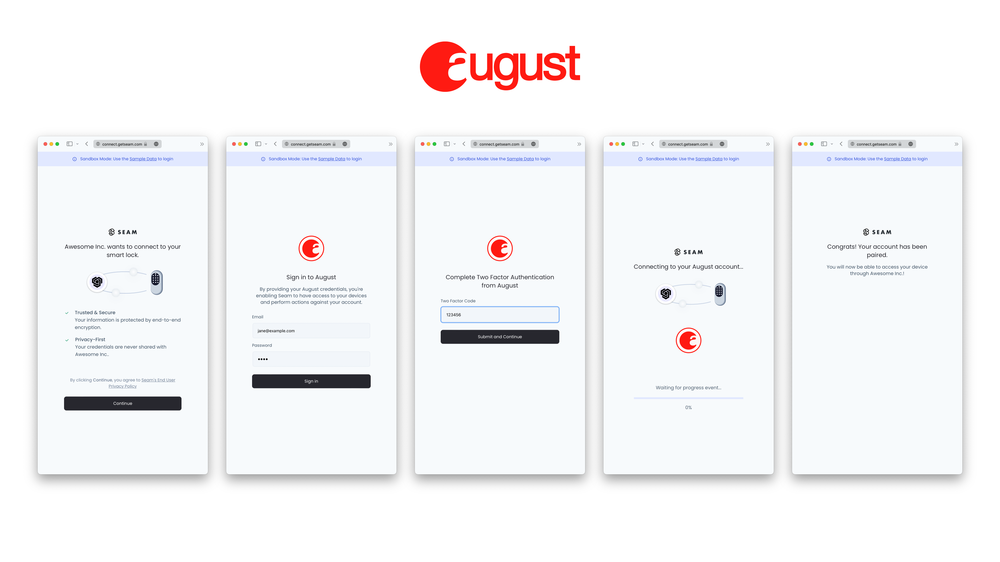

# Connect a Device

Before you can control a device, the owner of that device must first authorize your application. The owner may be you, or one of your application's users.

To do so, Seam provides [Connect Views](../core-concepts/connect-webviews.md). It's a fully managed UI-flows, guiding your user through device selection and authorization.


### Creating a Connect View Resource

To link a device with your workspace, the first step is to create a Connect View resource. The Seam API response will include a URL to redirect your user to.



```javascript
// Replace with
// const Seam = require("seamapi")
// if not using ES6 modules and/or TypeScript.
import Seam from "seamapi";

// Seam will automatically use the SEAM_API_KEY environment variable if you
// don't provide an apiKey to `new Seam()`
const seam = new Seam();

const createConnectView = async () => {
  const { connect_webview: connectView } = await seam.connectWebviews.create({
    accepted_providers: ["august"],
  });
  console.log(connectView);
};

createConnectView();


/*
{
  connect_webview_id: '14db0efd-50ae-45ef-9042-7f95c09082c2',
  custom_redirect_url: null,
  url: 'https://connect.getseam.com/v1/connect_webviews/view?connect_webview_id=14db0efd-50ae-45ef-9042-7f95c09082c2&auth_token=N4ZJau88guo5adHyBAPLsYdiCdoQvxpDb',
  workspace_id: 'ab804f5a-7dd2-42c8-8d09-0beff4f795eb',
  device_selection_mode: 'none',
  accepted_providers: [ 'august' ],
  accepted_devices: [],
  any_provider_allowed: false,
  any_device_allowed: null,
  created_at: '2022-02-16T17:45:10.523Z',
  login_successful: false,
  status: 'pending'
}
*/
```



```python
from seamapi import Seam

# Seam will automatically use the SEAM_API_KEY environment variable if you
# don't provide an api_key to `Seam()`
seam = Seam()
webview = seam.connect_webviews.create(accepted_providers=["august"])
print(webview)
# ConnectWebview(
#     connect_webview_id='54429654-8b80-4481-93ac-b631cbdf9647', 
#     status='pending', 
#     url='https://connect.getseam.com/v1/connect_webviews/view?connect_webview_id=54429654-8b80-4481-93ac-b631cbdf9647&auth_token=KmHkSPAxLEtwEZkLoepbj9HuySbC6EFyQ', 
#     login_successful=False, 
#     connected_account_id=None)

```



```ruby
require "seamapi"

seam = Seam::Client.new(api_key: "MY_API_KEY")

webview = seam.connect_webviews.create(
  accepted_providers: ["august"]
)

puts webview
# <Seam::ConnectWebview:0x006a950
#   url="https://connect.getseam.com/connect_webviews/view?connect_webview_id=123e4567-e89b-12d3-a456-426614174000&auth_token=q123DASDASKd23DADdad29"
#   status="pending"         
#   created_at="2022-07-06T23:20:09.785729+00:00"
#   workspace_id="123e4567-e89b-12d3-a456-426614174000"
#   accepted_devices=[]
#   login_successful=false
#   accepted_providers=["august"]
#   any_device_allowed=nil
#   connect_webview_id="123e4567-e89b-12d3-a456-426614174000"
#   custom_redirect_url=nil
#   any_provider_allowed=false
#   device_selection_mode="none">
```



```php
use Seam\SeamClient;

$seam = new SeamClient("YOUR_API_KEY");

$webview = $seam->connect_webviews->create(
  accepted_providers: ["august"]
);

echo json_encode($webview)
/*
{
  connect_webview_id: "14db0efd-50ae-45ef-9042-7f95c09082c2",
  custom_redirect_url: null,
  url: "https://connect.getseam.com/v1/connect_webviews/view?connect_webview_id=14db0efd-50ae-45ef-9042-7f95c09082c2&auth_token=N4ZJau88guo5adHyBAPLsYdiCdoQvxpDb",
  workspace_id: "ab804f5a-7dd2-42c8-8d09-0beff4f795eb",
  device_selection_mode: "none",
  accepted_providers: ["august"],
  accepted_devices: [],
  any_provider_allowed: false,
  any_device_allowed: null,
  created_at: "2022-02-16T17:45:10.523Z",
  login_successful: false,
  status: "pending"
}
*/
```



### Go to the View's URL

In a browser, enter the URL returned by the Connect View. You should see a simple welcome screen which will then be followed by a set of login screens.

Assuming you are in a sandbox workspace, you can use Jane's test account to connect to her August account and retrieve her device. Enter the following when prompted:

* email: `jane@example.com`
* password: `1234`
* 2FA code: `123456`

<figure><figcaption><p>Connect Webview Flow for linking an August Lock Account</p></figcaption></figure>


**Simulated Devices**

Seam's Sandbox workspace comes with simulated devices that behave like real ones. Simulated devices are handy for testing integrations without needing to own the actual device!

**Fake Users**

In the real world, devices belong to an owner. This owner can be you, or one of your users. To connect to their device, they must first authorize your application using their device credentials.

In the Seam Sandbox, we pre-seed fake device owners for you to use. Each simulated device belongs to a fake owner. To link a simulated device, you need its fake owner's account credentials. You can find those credentials in the [Sandbox guide](../device-guides/sandbox-and-sample-data/).


### Confirming Devices are Connected

Run the code below to confirm Jane successfully authorized and linked her August locks. We are now ready to start controlling Jane's devices! :tada:



```javascript
// Replace with
// const Seam = require("seamapi")
// if not using ES6 modules and/or TypeScript.
import Seam from "seamapi";

// Seam will automatically use the SEAM_API_KEY environment variable if you
// don't provide an apiKey to `new Seam()`
const seam = new Seam();

const checkDevices = async () => {
  const { devices } = await seam.locks.list();
  console.log(devices);
};

checkDevices();

/*
Jane's devices are here. Great!
[
  {
    device_id: '087c535b-39a7-40cb-9633-ade3d58e5e0e',
    device_type: 'august_lock',
    capabilities_supported: [ 'access_code', 'lock' ],
    properties: {
      locked: true,
      online: true,
      door_open: false,
      august_metadata: {
        lock_id: 'lock-1',
        lock_name: 'FRONT DOOR',
        house_name: 'My House'
      }
    },
    location: null,
    connected_account_id: '0c1ad2ce-7824-433c-bd85-90a32fdafb78',
    workspace_id: 'ab804f5a-7dd2-42c8-8d09-0beff4f795eb',
    created_at: '2022-02-16T06:58:50.643Z'
  },
  {
    device_id: '381f466b-3e15-48ad-896f-5810c8be2788',
    device_type: 'august_lock',
    capabilities_supported: [ 'access_code', 'lock' ],
    properties: {
      locked: true,
      online: true,
      door_open: false,
      august_metadata: {
        lock_id: 'lock-2',
        lock_name: 'BACK DOOR',
        house_name: 'My House'
      }
    },
    location: null,
    connected_account_id: '0c1ad2ce-7824-433c-bd85-90a32fdafb78',
    workspace_id: 'ab804f5a-7dd2-42c8-8d09-0beff4f795eb',
    created_at: '2022-02-16T06:58:50.882Z'
  },
  {
    device_id: '27fa4096-81ea-4258-91c0-ffe3e42f00ff',
    device_type: 'august_lock',
    capabilities_supported: [ 'access_code', 'lock' ],
    properties: {
      locked: false,
      online: true,
      door_open: false,
      august_metadata: {
        lock_id: 'lock-3',
        lock_name: 'GARAGE',
        house_name: 'My House'
      }
    },
    location: null,
    connected_account_id: '0c1ad2ce-7824-433c-bd85-90a32fdafb78',
    workspace_id: 'ab804f5a-7dd2-42c8-8d09-0beff4f795eb',
    created_at: '2022-02-16T06:58:51.089Z'
  }
]
*/

```



```python
from seamapi import Seam

# Seam will automatically use the SEAM_API_KEY environment variable if you
# don't provide an api_key to `Seam()`
seam = Seam()
locks = seam.locks.list()
print(locks)
# Jane's devices are here. Great!
# [
#    Device(device_id='27fa4096-81ea-4258-91c0-ffe3e42f00ff', device_type='august_lock', location=None, properties={'locked': False, 'online': True, 'door_open': False, 'august_metadata': {'lock_id': 'lock-3', 'lock_name': 'GARAGE', 'house_name': 'My House'}}, capabilities_supported=['access_code', 'lock']),
#    Device(device_id='087c535b-39a7-40cb-9633-ade3d58e5e0e', device_type='august_lock', location=None, properties={'locked': True, 'online': True, 'door_open': False, 'august_metadata': {'lock_id': 'lock-1', 'lock_name': 'FRONT DOOR', 'house_name': 'My House'}}, capabilities_supported=['access_code', 'lock']),
#    Device(device_id='381f466b-3e15-48ad-896f-5810c8be2788', device_type='august_lock', location=None, properties={'locked': True, 'online': True, 'door_open': False, 'august_metadata': {'lock_id': 'lock-2', 'lock_name': 'BACK DOOR', 'house_name': 'My House'}}, capabilities_supported=['access_code', 'lock'])
# ]

```



```ruby
require "seamapi"

seam = Seam::Client.new(api_key: "MY_API_KEY")

locks = seam.locks.list()
puts locks
# Jane's devices are here. Great!
#
# [<Seam::Device:0x001e870                                             
#   device_id="123e456727fa4096-81ea-4258-91c0-ffe3e42f00ff"                  
#   device_type="august_lock"
#   capabilities_supported=["access_code", "lock"]
#   connected_account_id="282f9d15-d979-4de7-b4eb-7097c401e910"
#   created_at="2022-07-06T09:43:08.944Z"                                 
#   properties={
#     "locked"=>false,
#     "online"=>true,
#     "battery_level"=>1,
#     "august_metadata"=>{
#       "lock_id"=>"123e4567-e89b-12d3-a456-426614174000",
#       "lock_name"=>"GARAGE"},
#     "name"=>"GARAGE"}
#   location=nil,
#   workspace_id="5cc6e99d-3ec1-4927-8d86-d6716c6703d9">]
```



```php
use Seam\SeamClient;

$seam = new SeamClient("YOUR_API_KEY");

$locks = $seam->locks->list();

echo json_encode($locks)
/*
[
  {
    device_id: "087c535b-39a7-40cb-9633-ade3d58e5e0e",
    device_type: "august_lock",
    capabilities_supported: ["access_code", "lock"],
    properties: {
      locked: true,
      online: true,
      door_open: false,
      august_metadata: {
        lock_id: "lock-1",
        lock_name: "FRONT DOOR",
        house_name: "My House"
      }
    },
    location: null,
    connected_account_id: "0c1ad2ce-7824-433c-bd85-90a32fdafb78",
    workspace_id: "ab804f5a-7dd2-42c8-8d09-0beff4f795eb",
    created_at: "2022-02-16T06:58:50.643Z"
  },
  {
    device_id: "381f466b-3e15-48ad-896f-5810c8be2788",
    device_type: "august_lock",
    capabilities_supported: ["access_code", "lock"],
    properties: {
      locked: true,
      online: true,
      door_open: false,
      august_metadata: {
        lock_id: "lock-2",
        lock_name: "BACK DOOR",
        house_name: "My House"
      }
    },
    location: null,
    connected_account_id: "0c1ad2ce-7824-433c-bd85-90a32fdafb78",
    workspace_id: "ab804f5a-7dd2-42c8-8d09-0beff4f795eb",
    created_at: "2022-02-16T06:58:50.882Z"
  }
]
*/
```


