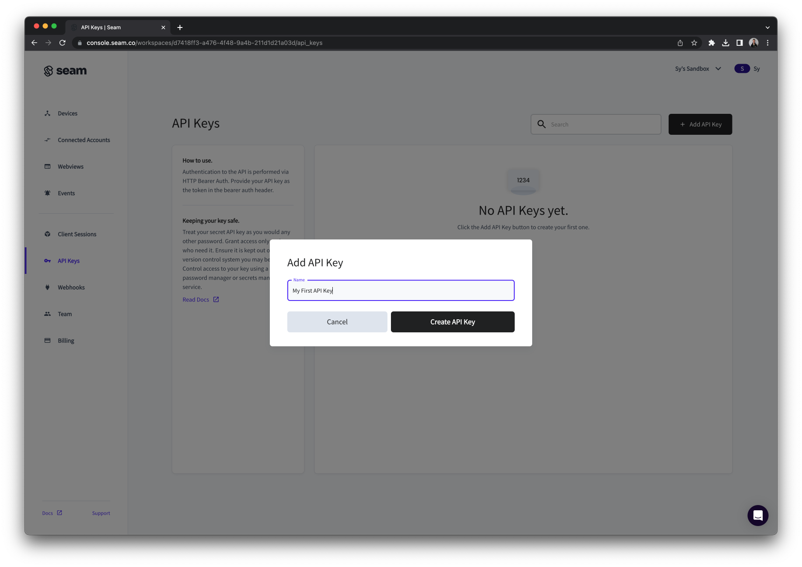
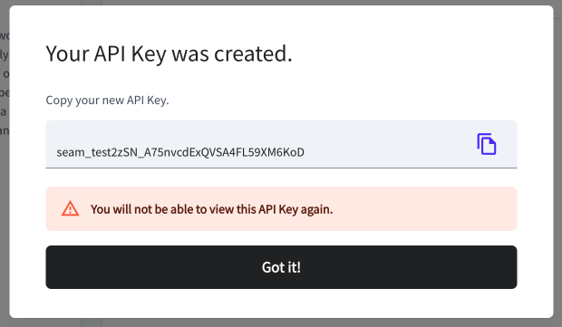

# Get API Key

Let's start by creating an API key to your Sandbox workspace. Our Sandbox lets you test your code against simulated devices that behave like the real ones. Go to the Dashboard, and use the workspace dropdown to select the "Test" sandbox. Then follow the following steps:

1. In the left nav, click on the "API Keys" menu item.
2. Next click the "Add API Key" button in the top right.&#x20;
3. Give your key a name and save it somewhere safe. We will not show it to you again as we have no way to do so.

<figure><figcaption></figcaption></figure>

<figure><figcaption></figcaption></figure>

<figure><figcaption></figcaption></figure>
