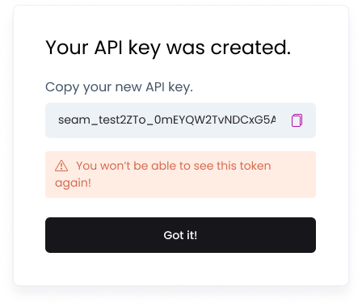

# Get API Key

Let's start by creating an API key to your Sandbox workspace. Our Sandbox lets you test your code against simulated devices that behave like the real ones.&#x20;

1. Go to the Dashboard, and use the workspace dropdown to select the "Test" sandbox.
2. In the left nav, click on API Keys.
3. Click the "Add API Key" button in the top right.&#x20;
4. Give your key a name, then save it somewhere safe.&#x20;

<figure><figcaption></figcaption></figure>

