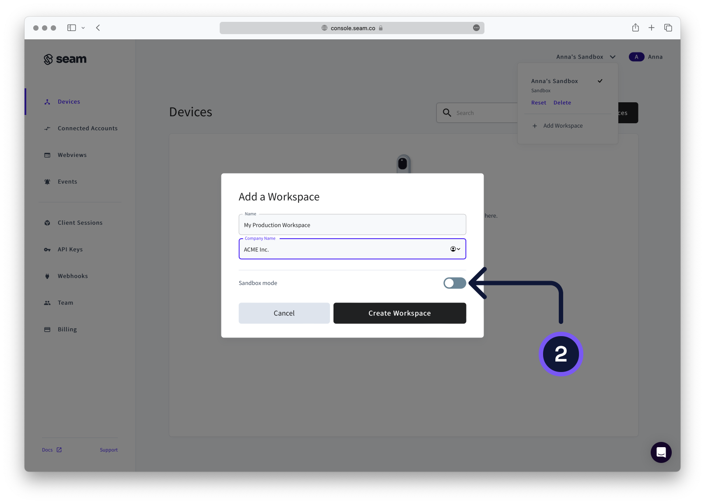
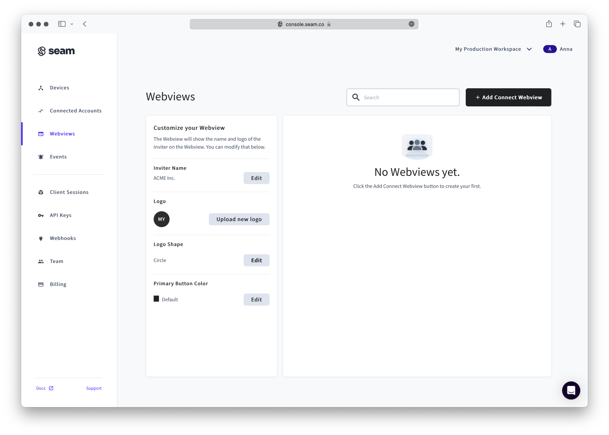

# Going Live! 🛫

## Create Production Workspace

When you first sign-up for Seam, a sandbox workspace is automatically created for you. Sandbox workspaces are great for testing with virtual devices, but once you're ready to connect a real device, you will first need to create a production workspace.&#x20;

To do so, click the chevron in the top right and the workspace selector will appear. Now click the "**+ Add Workspace**" button. A modal will come up for you to create a new workspace. Enter your new workspace name, your company name, and make to **leave the "Sandbox mode" switch off.**&#x20;

<figure><figcaption>
Click in the top right to show the Workspace switcher. Click "+ Add Workspace" to start.
</figcaption></figure>

<figure><figcaption>
Enter your workspace info and make sure to leave the sandbox mode switch off.
</figcaption></figure>

## Generate a Production API Key

Once you've switched to your non-sandbox production workspace (e.g. "My Production Workspace"), you will need to create an API key. Switch to the API Key menu on the left, and click the "**+ Add API Key**" to bring up the API key creation modal. Give it a name, and click create. Note that the resulting API key will not include the token "test" as is the case with sandbox workspaces.

<figure><figcaption>
Click the top right button to create an API key.
</figcaption></figure>

<figure><figcaption>
Give your API Key an easy to recognize name.
</figcaption></figure>

<figure><figcaption>
Save and store your API key somewhere safe. Seam is unable to show you this key again.
</figcaption></figure>

## Customize Login Portal

If you would like to customize the Seam login portal (learn about [Connect Webviews here](../core-concepts/connect-webviews.md)), go to the Webviews menu to add a logo, update the base color, or change the name displayed to your users.

<figure><figcaption></figcaption></figure>

