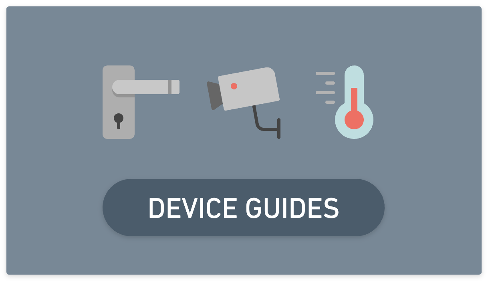

---
layout:
  title:
    visible: true
  description:
    visible: true
  tableOfContents:
    visible: false
  outline:
    visible: false
  pagination:
    visible: false
---

# Handling Recurring Access Codes

Seam supports scheduling access codes to a time bound period with a `starts_at` and `ends_at` time, but many times you'll want to create recurring daily or weekly codes to easily interface with cleaners, maintenance staff, or limit-availability access periods (such as a gym that's only accessible 9 to 5). You can implement Recurring Access Codes using the event driven pattern described in this document.

There are three main steps to implementing recurring access codes:

1. Create an access code at it's first scheduled "active period"
2. Set up a webhook for `access_code.removed_from_device`
3. Whenever an access\_code is deleted, set the access code's starts\_at and ends\_at to the next active period

## 1. Create an Access Code at it's First Scheduled "Active Period"

First, create an access code at the first "active period". Let's say that the first active period is tomorrow from 9am to 5pm. We'll create an access code the appropriate `starts_at` and `ends_at` time, then we'll save that access code to a user's `recurring_access_code_id` property, as shown below:




```python
from datetime import datetime, timedelta


tomorrow = datetime.now() + timedelta(days=1)
tomorrow_9am = tomorrow.replace(hour=9, minute=0, second=0, microsecond=0)
tomorrow_5pm = tomorrow.replace(hour=17, minute=0, second=0, microsecond=0)

access_code = seam.access_codes.create(
  name="My Recurring Access Code",
  starts_at=tomorrow_9am.isoformat(),
  ends_at=tomorrow_5pm.isoformat()
)

# Let's save this access code to a user
my_user.recurring_access_code_id = access_code.access_code_id
```



## 2. Set up a webhook for `access_code.removed_from_device`&#x20;

From the [Seam Console](https://console.seam.co/), set up a webhook to handle the `access_code.removed_from_device` event. This event is triggered whenever an access code is fully removed from a device, or at it's ends\_at time. By setting up a webhook, you'll receive an event every time the access code is removed.

<figure><figcaption><p>Creating a webhook for access_code.removed_from_device from console.seam.co</p></figcaption></figure>

## 3. Whenever an access\_code is deleted, create a new access code with the starts\_at and ends\_at to the next active period

Whenever your webhook endpoint is called to indicate that the access code has been removed, you should create a new access code at the next active period and replace the access code attached to the user.



```python
@app.route('/handle_event', methods=['POST'])
def handle_event():
  event = request.json["event"]
  
  if event["event_type"] == "access_code.removed_from_device":
    user = get_db_user(recurring_access_code_id=event["access_code_id"])
    
    if user.has_recurring_daily_code:
      # Create a new access code for the next active period
      tomorrow = datetime.now() + timedelta(days=1)
      tomorrow_9am = tomorrow.replace(hour=9, minute=0, second=0, microsecond=0)
      tomorrow_5pm = tomorrow.replace(hour=17, minute=0, second=0, microsecond=0)
      
      new_access_code = seam.access_codes.create(
        name="My Recurring Access Code",
        starts_at=tomorrow_9am.isoformat(),
        ends_at=tomorrow_5pm.isoformat()
      )
      
      user.recurring_access_code_id = new_access_code.access_code_id
      user.save()
  
```



## &#x20;


