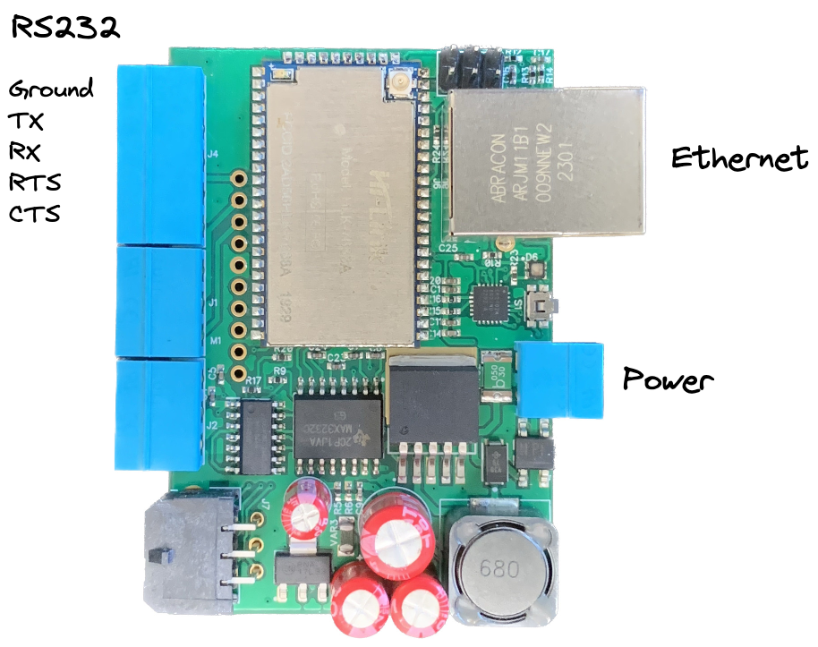

# Overview

The [Seam Bridge](https://www.seam.co/seam-bridge) can be used to connect traditionally offline devices to Seam. This guide will walk you through connecting your [DoorKing](https://www.seam.co/manufacturers/doorking) unit to Seam via the Bridge.

## Connecting the Seam Bridge to your DoorKing unit

First, wire the provided 5-pin terminal block to the DoorKing unit’s RS232 header. This can either be done via a DB9 cable (recommended) or directly between the two systems.

### DB9 Cable

#### DoorKing header

The DoorKing RS-232 header is located at the top left of the board.

From top to bottom, the pin order is:

1. `TX`
2. `RX`
3. `RTS`
4. `CTS`
5. `GND`

#### Seam Bridge terminal block

The Seam Bridge RS-232 connector is located at the top left of the board, when the Ethernet port is facing to the right.

From top to bottom, the pin order is:

1. `GND`
2. `TX`
3. `RX`
4. `RTS`
5. `CTS`

<figure><figcaption>
Seam Bridge pinout
</figcaption></figure>

### Connecting without a DB9 cable

If connecting a Bridge to a DoorKing unit without a DB9 cable, these are the connections that need to be made from the Seam Bridge → DoorKing:

1. `GND → GND`
2. `TX → RX`
3. `RX → TX`
4. `RTS → CTS`
5. `CTS → RTS`

## Configure your DoorKing unit

The Seam Bridge requires that the unit is configured for `19200` baud rate. This can be done by:

1. Entering `* 8 5 <master code>`
2. Entering `1` to select `19200`
3. Pressing `0` and `#` together to finish the programming sequence

## Connect power and Ethernet

1. Plug in Ethernet
2. Connect power. You can either use the provided 12V DC adapter or connect the Seam Bridge to any 9-36V AC or DC power source.

## Connect to Seam

Ask Seam support to enable the Bridge by emailing `support@getseam.com` or going to [seam.co](https://www.seam.co) and clicking the chat icon in the bottom right corner.
