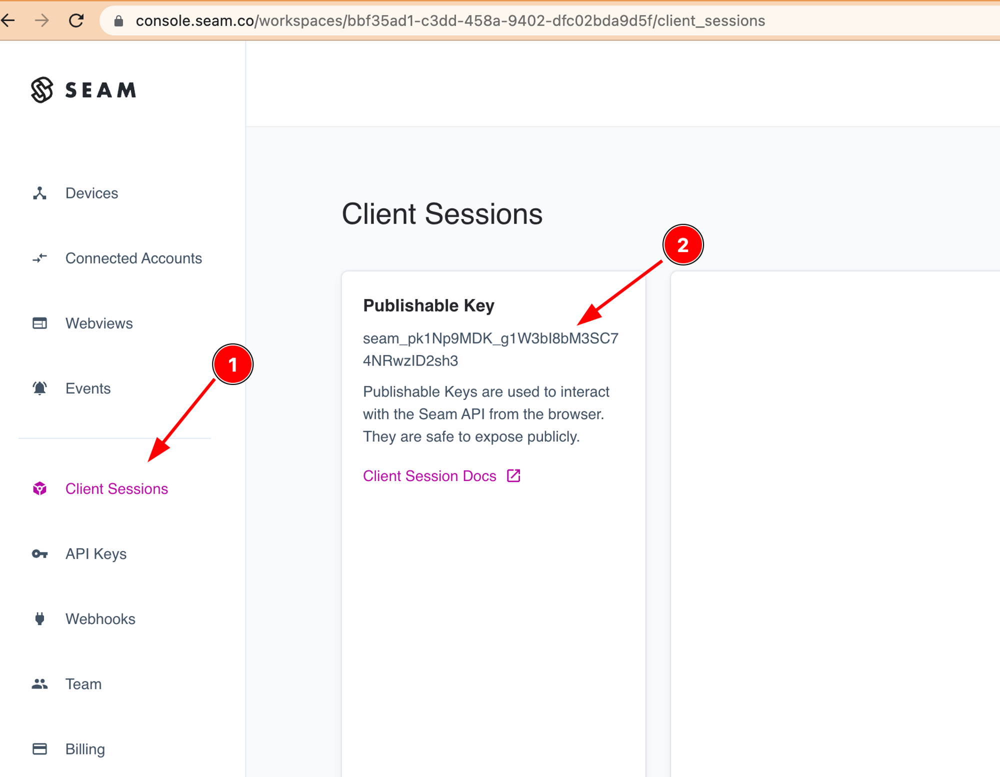
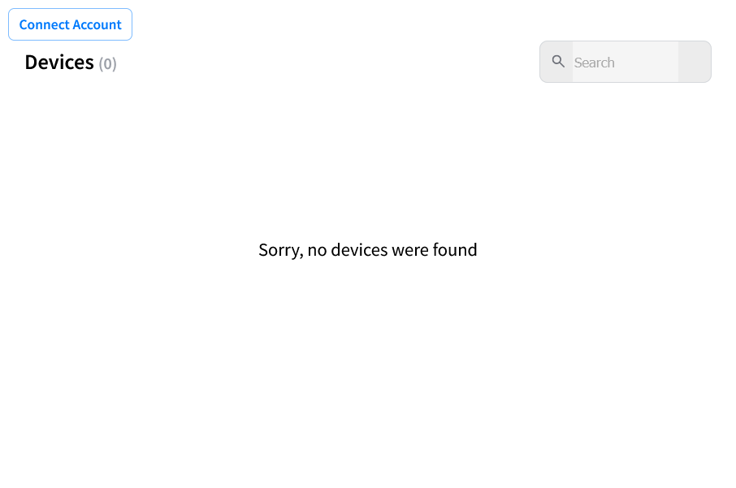
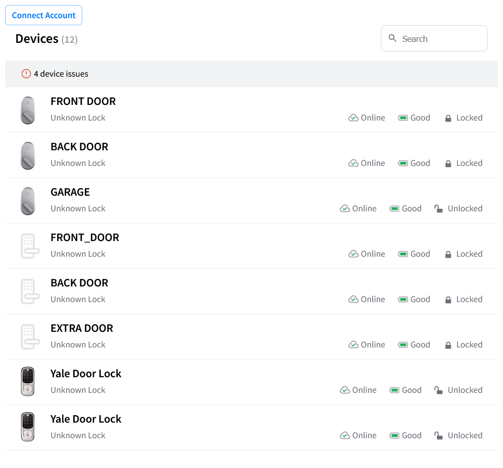

# Get started with Client Side Components

## Overview

Seam Components may be used on any website, in any web app, and with any framework all without needing a backend!

This guide will show you how to create a web page where a user may connect their third-party account to Seam and instantly start managing their devices. You can use plain HTML, React, or any framework that supports web components.

## 1 - Get a Publishable Key from the Seam Console

To access the Seam API, you'll need a publishable key. This key identifies your application when making requests to Seam and is safe to embed in your frontend code.

Go to [console.seam.co](https://console.seam.co) and select "Client Sessions" from the sidebar. You should then see a "Publishable Key" that you can copy.

<figure><figcaption></figcaption></figure>

## 2 — Add Seam Components



Seam Components are implemented in React, but may be used as native web components.

Create a plain HTML page with the content below. You can serve this anyway you like, or even open it directly in your browser. The version in the script tag can be any [released version](https://github.com/seamapi/react/releases).

```html
<!DOCTYPE html>
<html lang="en">
  <head>
    <meta charset="utf-8" />
    <meta name="viewport" content="width=device-width, initial-scale=1" />
    <title>Seam Components</title>
  </head>
  <body>
    <main>
      <seam-connect-account-button
        publishable-key="your_publishable_key"
      ></seam-connect-account-button>
      <seam-device-table
        publishable-key="your_publishable_key"
      ></seam-device-table>
    </main>
    <script
      type="module"
      src="https://react.seam.co/v/1.42.1/dist/elements.js"
    ></script>
  </body>
</html>
```



Install `@seamapi/react` in your React application

```bash
npm install --save @seamapi/react
```

Add the components anywhere in your React app

```javascript
import { ConnectAccountButton, DeviceTable, SeamProvider } from "@seamapi/react"

export const App = () => {
  return (
    <SeamProvider publishableKey="your_publishable_key">
      <main>
        <h1>Seam Components</h1>
        <ConnectAccountButton />
        <DeviceTable />
      </main>
    </SeamProvider>
  )
}
```



Install `@seamapi/react` in your application

```bash
npm install --save @seamapi/react
```

Then import the custom elements bundle in your application entrypoint:

```javascript
import "@seamapi/react/elements.js"
```

Add the components where your framework renders HTML. Some frameworks may require additional configuration to enable web component support, e.g., [Angular](angular.md) or [Vue](vue.md).

```html
<seam-connect-account-button publishable-key="your_publishable_key"></seam-connect-account-button>
<seam-device-table publishable-key="your_publishable_key"></seam-device-table>
```



You should see a page with an empty list of devices and a button to connect an account.

You could press the button now, but before you add some devices, there is one more step to complete to enable persisting and resuming the client session.

<figure><figcaption></figcaption></figure>

## 3 — Select a User Identifier Key

A User Identifier Key allows a device owner to make API requests to Seam where interactions are restricted only to the devices they own. You'll need to choose a scheme for uniquely segmenting device owners and pass it to the components.

Here are some suggestions for selecting a key:

* The key should be a secret only known by the user.
* The key should not be displayed anywhere visible in the app or URL bar.
* The key should be opaque and contain sufficient entropy like a version 4 UUID.
* You should have a way to invalidate and generate a new key.
* Do NOT use an email, name, phone number, or anything that might be known by a third party.

We recommend either using a version 4 UUID that you generate and store with your user metadata, or a salted hash of your internal user identifier.

Once you have selected a user identifier key, update your code as follows:



```html
<!DOCTYPE html>
<html lang="en">
  <head>
    <meta charset="utf-8" />
    <meta name="viewport" content="width=device-width, initial-scale=1" />
    <title>Seam Components</title>
  </head>
  <body>
    <main>
      <seam-connect-account-button
        publishable-key="your_publishable_key"
        user-identifier-key="your_user_identifier_key"
      ></seam-connect-account-button>
      <seam-device-table
        publishable-key="your_publishable_key"
        user-identifier-key="your_user_identifier_key"
      ></seam-device-table>
    </main>
    <script
      type="module"
      src="https://react.seam.co/v/1.18.0/dist/elements.js"
    ></script>
  </body>
</html>
```



```javascript
import { ConnectAccountButton, DeviceTable, SeamProvider } from "@seamapi/react";

export const App = () => {
  const { userIdentifierKey } = useAuth(); // or however you manage client side auth
  return (
    <SeamProvider
      publishableKey="your_publishable_key"
      userIdentifierKey={userIdentifierKey}
    >
      <main>
        <h1>Seam Components</h1>
        <ConnectAccountButton />
        <DeviceTable />
      </main>
    </SeamProvider>
  );
};

```



```html
<seam-connect-account-button
  publishable-key="your_publishable_key"
  user-identifier-key="your_user_identifier_key"
>
</seam-connect-account-button>
<seam-device-table
  publishable-key="your_publishable_key"
  user-identifier-key="your_user_identifier_key"
>
</seam-device-table>
```



Now, press the Connect Account button to open a Seam Connect Webview where you can login with your device provider. After logging in, you will be redirected back to this page where you should see your devices.

<figure><figcaption></figcaption></figure>

## Next Steps

* [Minimal sample apps](https://github.com/seamapi/seam-components-sample-apps) running Seam Components in various frameworks.
* View and play with other components in the [interactive storybook component library](https://react.seam.co/)
* Check out some [Full Example Apps](https://github.com/seamapi/react/tree/main/examples)

If you have any questions or want to report an issue, email us at support@seam.co.
