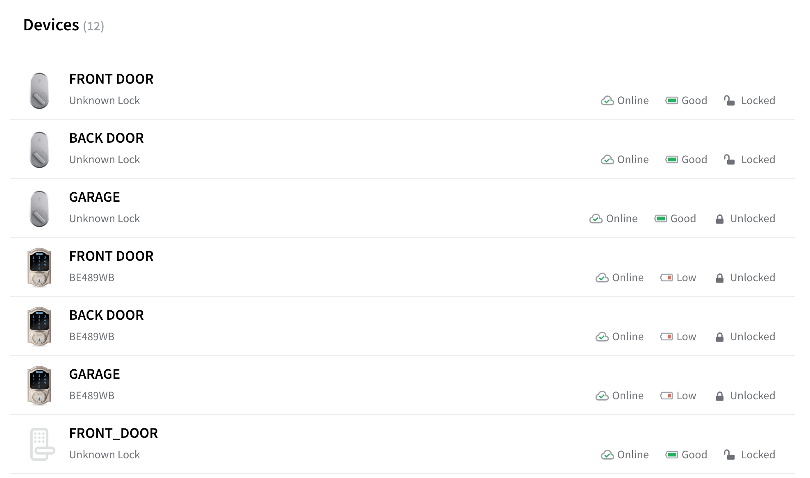

# Get started with React

## Overview

Seam Components may be used on any website, in any web app, and with any framework.

For this guide, we expect you to have a **backend server** and a **client frontend react application**. 
If you want to integrate Seam using only a client without a backend, you'll need to [use a Publishable Key](get-started-with-client-side-components.md).

Seam provides React components and hooks to connect and control many types of smart devices. This guide provides a rapid introduction to using React components with Client Sessions.


### What is a Client Session Token?

A Client Session Token allows a device owner to make API requests to Seam where interactions are restricted only to the devices they own. To enable your users to interact with their devices, you'll need to create a client session and pass its token to the `<SeamProvider />`.

## 1 — Install the Seam SDK on your Server

Seam provides client libraries for many languages such as Javascript, Python, Ruby, and PHP, as well as a Postman collection and [OpenAPI](https://connect.getseam.com/openapi.json) spec.

* **Javascript:** `npm i seam` ([npm](https://www.npmjs.com/package/seam), [github](https://github.com/seamapi/javascript))
* **Python:** `pip install seam` ([pip](https://pypi.org/project/seamapi/), [github](https://github.com/seamapi/python))
* **Ruby:** `bundle add seamapi` ([rubygem](https://rubygems.org/gems/seamapi), [github](https://github.com/seamapi/ruby))
* **PHP:** `composer require seamapi/seam` ([packagist](https://packagist.org/packages/seamapi/seam), [github](https://github.com/seamapi/php))

Once installed, [sign-up for Seam](https://console.seam.co/) to get your API key, and export it as an environment variable:

```
$ export SEAM_API_KEY=seam_test2ZTo_0mEYQW2TvNDCxG5Atpj85Ffw
```


This guide uses a Sandbox Workspace. Only virtual devices can be connected. If you need to connect a real August Lock, use a non-sandbox workspace and API key.


## 2 - Install `@seamapi/react` in your React application

```bash
npm install --save @seamapi/react
```

## 3 — Create a Seam Client Session on your Server, and pass it to the Client

We'll start by writing some server code that returns a client session. There are a lot of ways to do this depending on your server framework:

* Create an endpoint such as `/api/seam/get_client_session` and call it from your frontend app.
* Inject the client session token in your html if you're using an HTML templating engine.

For this guide, we'll assume you're creating an endpoint that will return a client session token. This is often appropriate for Single Page Applications.


For most applications, the `user_identifier_key` below should be be your internal user id.
For a detailed explanation, see [selecting a user Identifier key](./get-started-with-client-side-components.md#3-select-a-user-identifier-key).




```javascript
import { Seam } from "seamapi"

export default (req, res) => {
  // Handle authentication logic.
  const userId = req.auth.userId

  // Pull any connected accounts associated with this user.
  // If the user will create connect webviews from the client using the client session token,
  // e.g., via the <ConnectAccountButton /> component,
  // ensure your application associates those connected account ids here,
  // otherwise the client will not see devices connected from those accounts.
  const accountsAssociatedWithUser = [{ seamConnectedAccountId: "..." }]

  const seam = new Seam()

  // Get or create the client session for the user.
  // Pass an array of connected_account_ids, connect_webview_ids or both.
  // If the client session already exists, Seam will update the allowed connected_account_ids
  // and connect_webview_ids to the latest value provided here.
  const clientSession = await seam.clientSessions.getOrCreate({
    user_identifier_key: userId,
    connected_account_ids: accountsAssociatedWithUser.map(
      (acc) => acc.seamConnectedAccountId
    ),
  })

  res.status(200).json({
    token: clientSession.token,
  })
}
```



```php
<?php

namespace App\Http\Controllers\Api;

use App\Http\Controllers\Controller;
use Illuminate\Http\Request;

class SeamController extends Controller
{
    public function getSeamClientSession()
    {
      // Handle authentication logic.
      $userId = request()->userId;

      // Pull any connected accounts associated with this user.
      // If the user will create connect webviews from the client using the client session token,
      // e.g., via the <ConnectAccountButton /> component,
      // ensure your application associates those connected account ids here,
      // otherwise the client will not see devices connected from those accounts.
      $accountsAssociatedWithUser = array(["seamConnectedAccountId" => "..."]);

        $data = [
            // Get or create the client session for the user.
            // Pass an array of connected_account_ids, connect_webview_ids or both.
            // If the client session already exists, Seam will update the allowed connected_account_ids
            // and connect_webview_ids to the latest value provided here.
            'seamClientSession' => $seam->client_sessions->get_or_create(
              connected_account_ids: array_column($accountsAssociatedWithUser, 'seamConnectedAccountId');
            )
        ];

        return response()->json($data);
    }
}
```

```php
// routes/api.php
// ...
Route::get('/seam/get_seam_client_session', 'Api\SeamController@getSeamClientSession');
// ...

```



Awesome! We can now request this from the frontend client application using a hook like this:

```javascript
// lib/hooks/use-seam-client-session-token.js
import { useState, useEffect } from "react"

export const useSeamClientSessionToken = () => {
  const { myAppAuthToken } = useAuth() // or however you manage client side auth
  const [token, setToken] = useState()

  useEffect(async () => {
    const res = await fetch("/api/seam/get_client_session", {
      method: "POST",
      headers: {
        Authorization: `Bearer ${myAppAuthToken}`,
      },
    })
    if (res.ok) {
      const data = await res.json()
      setToken(res.token)
    }
  }, [myAppAuthToken])

  return token
}
```


Why do we need the backend for getting the Client Session Token? It allows you to use your application's existing authentication! If you want to have Seam handle all the user authentication, you can use a publishable key, but we recommend using client session tokens!


## 4 - Use Your Client Session Token to Display a User's Devices

```javascript
import { SeamProvider, DeviceTable } from "@seamapi/react"
import { useSeamClientSessionToken } from "lib/hooks/use-seam-client-session-token"

export const App = () => {
  const clientSessionToken = useSeamClientSessionToken()
  if (clientSessionToken == null) return <p>Loading...</p>
  return (
    <SeamProvider clientSessionToken={clientSessionToken}>
      <DeviceTable />
    </SeamProvider>
  )
}
```

You should see a list of devices like what's shown below:

<figure><figcaption><p>Device Table React Component</p></figcaption></figure>

## Next Steps

* [Minimal sample apps](https://github.com/seamapi/seam-components-sample-apps) running Seam Components in various frameworks.
* View and play with components in the [interactive storybook component library](https://react.seam.co/)
* Check out some [Full Example Apps](https://github.com/seamapi/react/tree/main/examples)

If you have any questions or want to report an issue, email us at support@seam.co.
