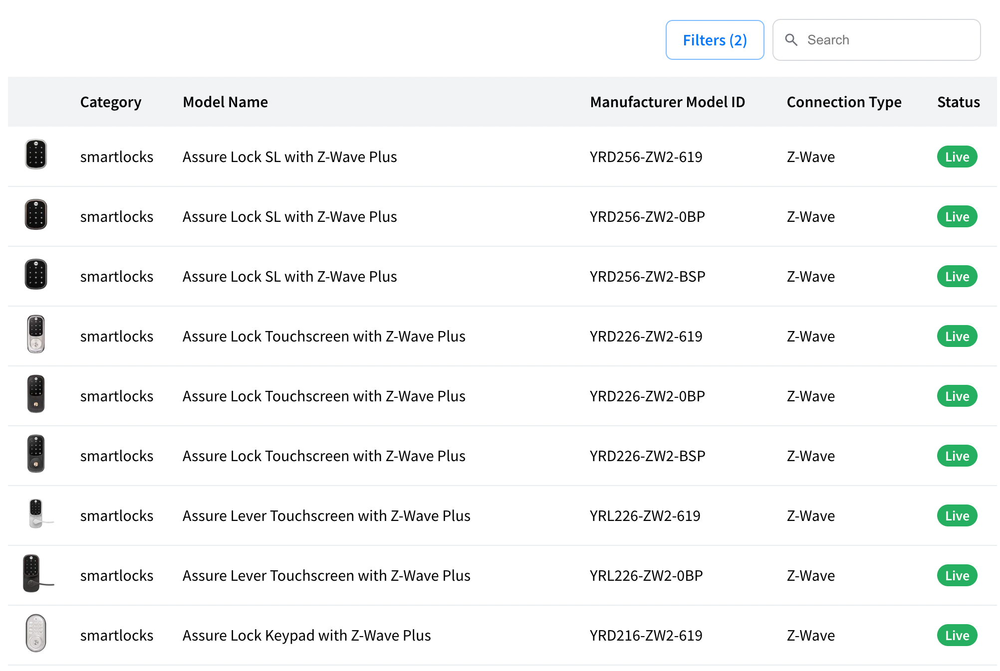

# Get started with Vue

## Overview

This guide will show you how to use Seam Components inside a Vue application. Seam Components are implemented in React, but may be used anywhere as native web components.

## 1 - Get a Publishable Key from the Seam Console

To access the Seam API, you'll need a publishable key. This key identifies your application when making requests to Seam and is safe to embed in your frontend code.

Go to [console.seam.co](https://console.seam.co) and select "Client Sessions" from the sidebar. You should then see a "Publishable Key" that you can copy.

<figure><figcaption></figcaption></figure>

## 2 - Install `@seamapi/react` in your Vue application

Install the npm package

```bash
npm install --save @seamapi/react
```

Then import the custom elements bundle in you `main.js` application entrypoint:

```javascript
import "@seamapi/react/elements.js"

import './assets/main.css'

import { createApp } from 'vue'
```

## 3 — Skip Component Resolution

From the [Vue Docs](https://vuejs.org/guide/extras/web-components.html#skipping-component-resolution):

> By default, Vue will attempt to resolve a non-native HTML tag as a registered Vue component before falling back to rendering it as a custom element. This will cause Vue to emit a "failed to resolve component" warning during development. To let Vue know that certain elements should be treated as custom elements and skip component resolution, we can specify the `compilerOptions.isCustomElement` option.




```javascript
// Only works if using in-browser compilation.
// If using build tools, see config examples below.
app.config.compilerOptions.isCustomElement = (tag) => tag.startsWith('seam-')
```




```javascript
// vite.config.js
import vue from '@vitejs/plugin-vue'

export default {
  plugins: [
    vue({
      template: {
        compilerOptions: {
          isCustomElement: (tag) => tag.startsWith('seam-')
        }
      }
    })
  ]
}
```





```javascript
// vue.config.js
module.exports = {
  chainWebpack: config => {
    config.module
      .rule('vue')
      .use('vue-loader')
      .tap(options => ({
        ...options,
        compilerOptions: {
          isCustomElement: tag => tag.startsWith('seam-')
        }
      }))
  }
}
```





```javascript
// Before calling new Vue(...)
Vue.config.ignoredElements = [/^seam-/]
```





## 4 - Use the component

Use the components in `App.vue`:

```html
<main>
  <seam-supported-device-table
    publishable-key="your_publishable_key'"
  ></seam-supported-device-table>
</main>
```

You should see a list of device models like what's shown below:

<figure><figcaption></figcaption></figure>

## Next Steps

* [Minimal sample app](https://github.com/seamapi/seam-components-sample-apps/tree/main/vue-web-components) running Seam Web Components in Vue 3.
* [Minimal sample app](https://github.com/seamapi/seam-components-sample-apps/tree/main/vue-2-web-components) running Seam Web Components in Vue 2.
* Start connecting devices using [Client Side Components](get-started-with-client-side-components.md) or with [Client Session Tokens](get-started-with-react-components-and-client-session-tokens.md).
* View and play with other components in the [interactive storybook component library](https://react.seam.co/)
* Check out some [Full Example Apps](https://github.com/seamapi/react/tree/main/examples)

If you have any questions or want to report an issue, email us at support@seam.co.
