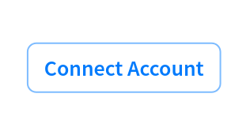

# Components Guide

## \<SeamProvider/>

The SeamProvider component accepts a `clientSessionToken` that enables descendants of the SeamProvider to use the Seam API. A Client Session Token allows a device owner to make API requests to Seam where interactions are restricted only to devices they own. To enable your users to interact with their devices, you'll need to create a client session and pass its token to the `<SeamProvider />` .

See [this guide](get-started-with-react-components-and-client-session-tokens.md) for instructions on how to create a client session token.

```
<SeamProvider clientSessionToken={clientSessionToken}>
  <DeviceTable />
</SeamProvider>
```

### Props

| Name                                                 | Type   | Description                                                                                                                           |
| ---------------------------------------------------- | ------ | ------------------------------------------------------------------------------------------------------------------------------------- |
| clientSessionToken<mark style="color:red;">\*</mark> | string | A Client Session Token allows a device owner to make API requests to Seam where interactions are restricted only to devices they own. |

## \<ConnectAccountButton/> [(preview)](https://react.seam.co/?path=/docs/example-connectaccountbutton--docs)

The connect account button opens a new Connect Webview.
Accounts connected from this webview will be associated with the active client session.

```
<ConnectAccountButton />
```

### Size: Desktop

<figure><figcaption></figcaption></figure>

### Props

| Name   | Type     | Description                                                                                                       |
| ------ | -------- | ----------------------------------------------------------------------------------------------------------------- |
| className | string | <p>Optional class name to add to the rendered component's containing element. |

## \<DeviceTable /> [(preview)](https://react.seam.co/?path=/docs/example-devicetable--docs)

The devices table shows a list of devices and their statuses.

```
<DeviceTable />
```

### Size: Desktop

<figure><figcaption></figcaption></figure>

### Size: Modal

<figure><figcaption></figcaption></figure>

### Props

| Name   | Type     | Description                                                                                                       |
| ------ | -------- | ----------------------------------------------------------------------------------------------------------------- |
| deviceIds | array | <p>Optional list of specific device ids to return when requesting devices from the Seam API.</p> |
| connectedAccountIds | array | <p>Optional list of connected account ids to filter devices by when requesting devices from the Seam API.</p> |
| disableLockUnlock | boolean | <p>Hide the lock/unlock button for devices. Default: `false`.</p> |
| deviceFilter | function | <p>Optional filter function to filter the listed devices.<br><br>Signature: <code>(device: Device, searchInputValue: string) => boolean</code></p> |
| deviceComparator | function | <p>Optional comparator function to order the listed devices.<br><br>Signature: <code>(deviceA: Device, deviceB: Device) => number</code></p> |
| onDeviceClick | function | <p>Optional callback fired when a device is clicked.<br><br>Signature: <code>(deviceId: string) => void</code></p> |
| preventDefaultOnDeviceClick | boolean | Prevent the default behavior when a device is clicked. Default: `false` |
| onBack | function | <p>Optional callback fired when the Back chevron button is clicked.<br><br>Signature: <code>() => void</code></p> |
| className | string | <p>Optional class name to add to the rendered component's containing element. |

## \<DeviceDetails /> [(preview)](https://react.seam.co/?path=/docs/example-devicedetails--docs)

The device details component shows the properties, settings, and issues for a device.

```
<DeviceDetails deviceId={deviceId} />
```

### Size: Modal

<figure><figcaption></figcaption></figure>

### Props

| Name                                       | Type     | Description                                                                                                       |
| ------------------------------------------ | -------- | ----------------------------------------------------------------------------------------------------------------- |
| deviceId<mark style="color:red;">\*</mark> | string   | The id for the device that will be shown in the table.                                                            |
| disableLockUnlock | boolean | <p>Hide the lock/unlock button for devices. Default: `false`.</p> |
| onBack                                     | function | <p>Optional callback fired when the Back chevron button is clicked.<br><br>Signature: <code>() => void</code></p> |
| className | string | <p>Optional class name to add to the rendered component's containing element. |

## \<AccessCodeTable /> [(preview)](https://react.seam.co/?path=/docs/example-accesscodetable--docs)

The access codes table shows a list of current and future access codes and their statuses.

```
<AccessCodeTable deviceId={deviceId} />
```

### Size: Mobile

<figure><figcaption></figcaption></figure>

### Size: Desktop

<figure><figcaption></figcaption></figure>

### Props

| Name                                       | Type     | Description                                                                                                       |
| ------------------------------------------ | -------- | ----------------------------------------------------------------------------------------------------------------- |
| deviceId<mark style="color:red;">\*</mark> | string   | The id for the device whose access codes will be shown in the table.                                              |
| disableLockUnlock | boolean | <p>Hide the lock/unlock button for devices. Default: `false`.</p> |
| accessCodeFilter | function | <p>Optional filter function to filter the listed access codes.<br><br>Signature: <code>(accessCode: AccessCode, searchInputValue: string) => boolean</code></p> |
| accessCodeComparator | function | <p>Optional comparator function to order the listed access codes.<br><br>Signature: <code>(accessCodeA: AccessCode, accessCodeB: AccessCode) => number</code></p> |
| onAccessCodeClick | function | <p>Optional callback fired when an access code is clicked.<br><br>Signature: <code>(accessCodeId: string) => void</code></p> |
| preventDefaultOnAccessCodeClick | boolean | Prevent the default behavior when an access code is clicked. Default: `false` |
| onBack                                     | function | <p>Optional callback fired when the Back chevron button is clicked.<br><br>Signature: <code>() => void</code></p> |
| className | string | <p>Optional class name to add to the rendered component's containing element. |

## \<AccessCodeDetails /> [(preview)](https://react.seam.co/?path=/docs/example-accesscodedetails--docs)

The access code details component shows the properties, settings, and issues for an access code.

```
<AccessCodeDetails accessCodeId={accessCodeId} />
```

### Size: Mobile

<figure><figcaption></figcaption></figure>

### Props

| Name           | Type     | Description                                 |
| -------------- | -------- | ------------------------------------------- |
| accessCodeId\* | string   | The id for the access code to be displayed. |
| disableLockUnlock | boolean | <p>Hide the lock/unlock button for devices. Default: `false`.</p> |
| onBack         | function | true                                        |
| className | string | <p>Optional class name to add to the rendered component's containing element. |

## \<SupportedDeviceTable /> [(preview)](https://react.seam.co/?path=/docs/example-supporteddevices--docs)

The supported device table allows you to filter, sort, and view all the devices compatible with Seam. You can use this table to indicate what devices are supported by your platform.

```ts
<SupportedDeviceTable />
```

### Props

| Name          | Type    | Description                                             |
| ------------- | ------- | ------------------------------------------------------- |
| disableLockUnlock | boolean | <p>Hide the lock/unlock button for devices. Default: `false`.</p> |
| className | string | <p>Optional class name to add to the rendered component's containing element. |

<figure><figcaption></figcaption></figure>
