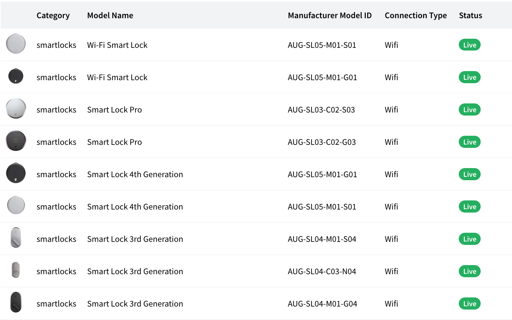

# React Components

## \<SeamProvider/>

The Provider component accepts a `clientSessionToken` prop to be passed to consuming components that are descendants of this Provider. A Client Session Token allows a device owner to make API requests to Seam where interactions are restricted only to devices they own. To enable your users to interact with their devices, you'll need to create a client session and pass its token to the `<SeamProvider />` .

See [this guide](get-started-with-react-components-and-client-session-tokens.md) for instructions on how to create a client session token.

```
<SeamProvider clientSessionToken={clientSessionToken}>
    <DeviceTable />
</SeamProvider>
```

### Props

| Name                                                 | Type   | Description                                                                                                                           |
| ---------------------------------------------------- | ------ | ------------------------------------------------------------------------------------------------------------------------------------- |
| clientSessionToken<mark style="color:red;">\*</mark> | string | A Client Session Token allows a device owner to make API requests to Seam where interactions are restricted only to devices they own. |

## \<DeviceTable /> [(preview)](https://seam-react.vercel.app/?path=/docs/example-devicetable--docs)

The devices table shows a list of devices and their statuses.

```
<SeamProvider clientSessionToken={clientSessionToken}>
    <DeviceTable />
</SeamProvider>
```

### Size: Desktop

<figure><figcaption></figcaption></figure>

### Size: Modal

<figure><figcaption></figcaption></figure>

### Props

| Name   | Type     | Optional | Description                                                                                                        |
| ------ | -------- | -------- | ------------------------------------------------------------------------------------------------------------------ |
| onBack | function | true     | <p>Callback fired when the "Back" chevron button is clicked.<br><br>Signature: <code>function() => void</code></p> |

## \<DeviceDetails /> [(preview)](https://seam-react.vercel.app/?path=/docs/example-devicedetails--docs)

The device details component shows the properties, settings, and issues for a device.

```
<SeamProvider clientSessionToken={clientSessionToken}>
    <DeviceDetails deviceId={deviceId} />
</SeamProvider>
```

### Size: Modal

<figure><figcaption></figcaption></figure>

### Props

| Name                                       | Type     | Optional | Description                                                                                                        |
| ------------------------------------------ | -------- | -------- | ------------------------------------------------------------------------------------------------------------------ |
| deviceId<mark style="color:red;">\*</mark> | string   |          | The id for the device that will be shown in the table                                                              |
| onBack                                     | function | true     | <p>Callback fired when the "Back" chevron button is clicked.<br><br>Signature: <code>function() => void</code></p> |

## \<AccessCodeTable /> [(preview)](https://seam-react.vercel.app/?path=/docs/example-accesscodetable--docs)

The access codes table shows a list of current and future access codes and their statuses.

```
<SeamProvider clientSessionToken={clientSessionToken}>
    <AccessCodeTable deviceId={deviceId} />
</SeamProvider>
```

### Size: Mobile

<figure><figcaption></figcaption></figure>

### Size: Desktop

<figure><figcaption></figcaption></figure>

### Props

| Name                                       | Type     | Optional | Description                                                                                                        |
| ------------------------------------------ | -------- | -------- | ------------------------------------------------------------------------------------------------------------------ |
| deviceId<mark style="color:red;">\*</mark> | string   |          | The id for the device whose access codes will be shown in the table                                                |
| onBack                                     | function | true     | <p>Callback fired when the "Back" chevron button is clicked.<br><br>Signature: <code>function() => void</code></p> |

## \<AccessCodeDetails /> [(preview)](https://seam-react.vercel.app/?path=/docs/example-accesscodedetails--docs)

The access code details component shows the properties, settings, and issues for an access code.

```
<SeamProvider clientSessionToken={clientSessionToken}>
    <AccessCodeDetails accessCodeId={accessCodeId} />
</SeamProvider>
```

### Size: Mobile

<figure><figcaption></figcaption></figure>

### Props

| Name           | Type   | Description                                             |
| -------------- | ------ | ------------------------------------------------------- |
| accessCodeId\* | string | The id for the access code to be displayed.             |
| onBack         |        | Callback fired when the Back chevron button is clicked. |

## \<SupportedDevices /> [(preview)](https://seam-react.vercel.app/?path=/docs/example-supporteddevices--docs)

The Supported Devices table allows you to filter, sort and view all the
devices compatible with Seam. You can use this table to indicate what
devices are supported by your platform.

```ts
<SupportedDevices />
```

<figure><figcaption></figcaption></figure>
