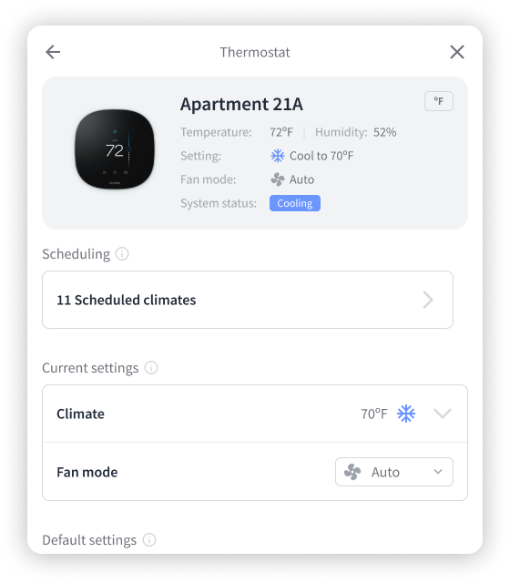

# Device Details

## \<DeviceDetails /> [(preview)](https://react.seam.co/?path=/docs/components-devicedetails--docs)

The device details component shows the properties, settings, and issues for a device.

```
<DeviceDetails deviceId={deviceId} />
```

### Different Device Views

The `DeviceDetails` will display varying views based on the device type.

#### Door Lock details

The "Lock" detail view displays a button leading to the list of access codes, along with various lock properties.

<figure><figcaption></figcaption></figure>

#### Thermostat details

The "Thermostat" detail view provides a button to view the list of scheduled climates and buttons to adjust the thermostat settings.

<figure><figcaption></figcaption></figure>

### Props

The `DeviceDetails` component displays the device as identified by the `deviceId` property. You can customize the component by turning off features like `disableLockUnlock` for door locks.

| Name                                       | Type     | Description                                                                                                       |
| ------------------------------------------ | -------- | ----------------------------------------------------------------------------------------------------------------- |
| deviceId<mark style="color:red;">\*</mark> | string   | The id for the device that will be shown in the table.                                                            |
| disableLockUnlock                          | boolean  | Hide the lock/unlock button for devices. Default: `false`.                                                        |
| onBack                                     | function | <p>Optional callback fired when the Back chevron button is clicked.<br><br>Signature: <code>() => void</code></p> |
| className                                  | string   | Optional class name to add to the rendered component's containing element.                                        |
