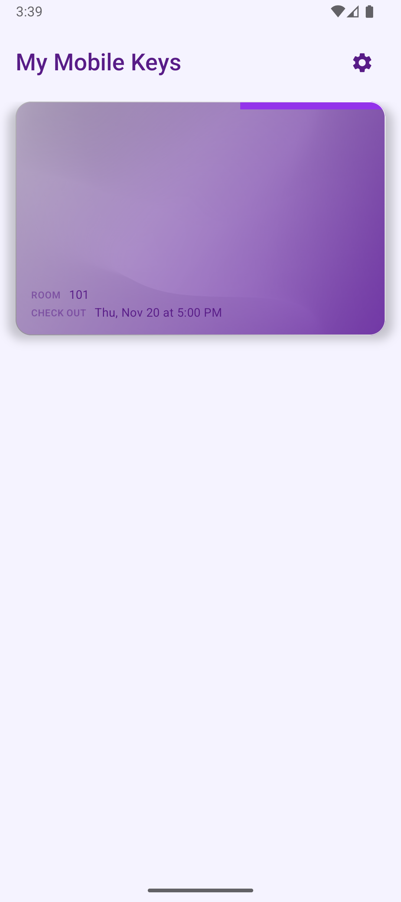
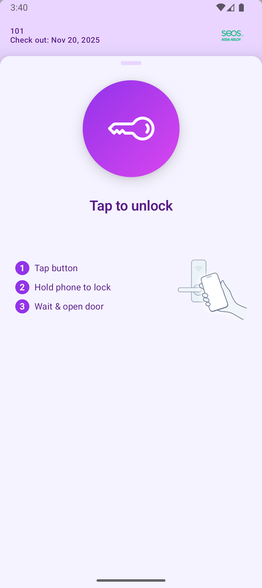
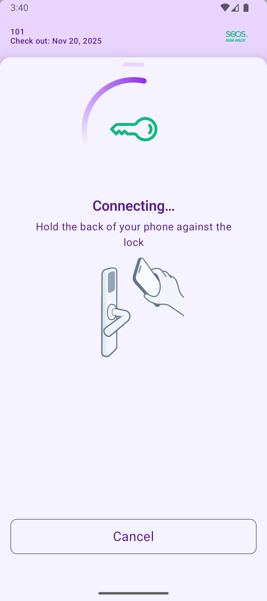

# Theming

<!-- TODO: change pictures -->
<div><figure><figcaption></figcaption></figure> <figure><figcaption></figcaption></figure> <figure><figcaption></figcaption></figure></div>

Seam Mobile Components are fully customizable using Material 3 theming integrated with Seam's component-specific styling system. You can customize colors, typography, and detailed component styles to match your brand.

***

### How theming works

The simplest way to theme Seam components is to use `SeamComponentsTheme` with your Material 3 color schemes:

```kotlin
@Composable
fun MyApp() {
    val lightColors = lightColorScheme(
        primary = Color(0xFF1976D2),
        onPrimary = Color.White,
        secondary = Color(0xFF757575),
        onSecondary = Color.White,
        background = Color.White,
        onBackground = Color(0xFF212121)
    )

    val darkColors = darkColorScheme(
        primary = Color(0xFF90CAF9),
        onPrimary = Color(0xFF003C7E),
        secondary = Color(0xFF424242),
        onSecondary = Color.White,
        background = Color(0xFF121212),
        onBackground = Color.White
    )

    val colorScheme = if (isSystemInDarkTheme()) darkColors else lightColors

    SeamComponentsTheme(
        colorScheme = colorScheme
    ) {
        SeamAccessView(
            clientSessionToken = "your-token"
        )
    }
}
```
