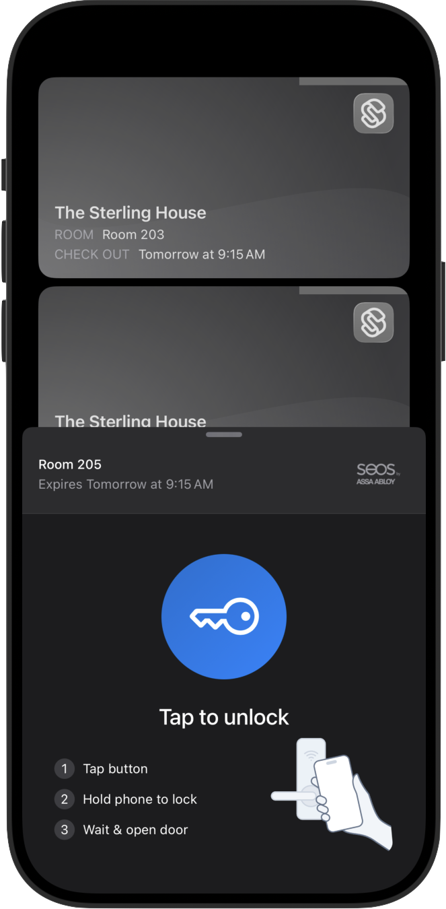
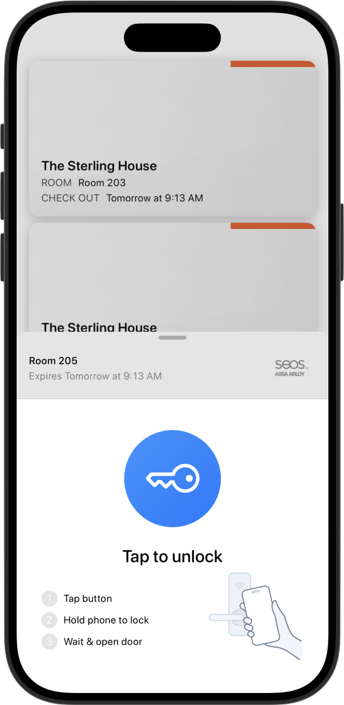

# Theming

<div><figure><figcaption></figcaption></figure> <figure><figcaption></figcaption></figure> <figure><figcaption></figcaption></figure></div>

Seam Mobile Components are white-label ready. You control appearance by providing a SeamTheme via the SwiftUI environment. The theme is a semantic palette composed of nested palettes—colors, fonts, keyCard, toast, and unlockCard—so you can brand globally or override locally.

> All SeamComponents (e.g., SeamAccessView, SeamKeyCardView, SeamCredentialsView, SeamUnlockCardView) automatically read the theme from EnvironmentValues.seamTheme.

***

### How theming works

* Environment-driven: Inject a SeamTheme anywhere in your view hierarchy:

```swift
.environment(\.seamTheme, customTheme)
```

* Defaults provided: If you don’t inject a theme, components use SeamTheme.default.
* Partial overrides: Every nested palette supports .with(...) so you can change a few fields without redefining everything.

***

### Quick start

#### **App-wide theme (recommended)**

Inject a theme at the root so all Seam components share a consistent look:

```swift
import SwiftUI
import SeamComponents

@main
struct MyApp: App {
    private let customTheme = SeamTheme(
        colors: .default.with(
            accent: .orange,
            error: .pink
        ),
        fonts: .default.with(
            largeTitle: .system(size: 36, weight: .bold)
        ),
        keyCard: .default.with(
            cornerRadius: 20 // see KeyCard palette
        )
    )

    var body: some Scene {
        WindowGroup {
            SeamAccessView()
                .environment(\.seamTheme, customTheme)
        }
    }
}
```

#### Local override

Scope a different look to a subsection of your UI:

```swift
let alertyToast = SeamTheme.Toast.default.with(
    background: .red.opacity(0.1),
    borderColor: .red,
    textColor: .primary
)

SeamAccessView()
    .environment(\.seamTheme, .default.with(
        toast: alertyToast
    ))
```

### Theme structure

SeamTheme groups styling into five nested palettes. Each has:

* A default value that matches iOS look & feel.
* A memberwise initializer (for full control).
* A with(...) builder to override specific fields.

***

### Composing a theme

Use the top-level SeamTheme.with(...) to swap in any subset of palettes:

```swift
let theme = SeamTheme.default.with(
    colors: .default.with(accent: .indigo),
    fonts: .default.with(title2: .system(.title2, design: .rounded)),
    keyCard: .default.with(cornerRadius: 22),
    toast: .default.with(accentColor: .indigo),
    unlockCard: .default.with(progressColor: .indigo)
)
```

Then inject:

```swift
SeamAccessView()
    .environment(\.seamTheme, theme)
```

***

### Dark mode

* The defaults are light/dark adaptive by relying on system colors (e.g., Color(UIColor.systemBackground), .primary, .secondary).
* When customizing, prefer dynamic colors or provide your own light/dark logic:

```swift
let colors = SeamTheme.Colors.default.with(
    primaryBackground: Color(light: .white, dark: .black)
)
```

***

### Best practices

* Start with defaults, then override selectively with .with(...).
* Keep contrast high for accessibility; test in light and dark modes.
* Brand consistently by driving accent, key button gradient, and toast accent from the same hue family.
* Scope locally if a one-off component needs a different visual treatment.

***

### API reference at a glance

* SeamTheme.default — system-aligned theme
* EnvironmentValues.seamTheme — environment key for theming
* Builders:
  * SeamTheme.with(colors:fonts:keyCard:toast:unlockCard:)
  * SeamTheme.Colors.default.with(...)
  * SeamTheme.Fonts.default.with(...)
  * SeamTheme.KeyCard.default.with(...)
  * SeamTheme.Toast.default.with(...)
  * SeamTheme.UnlockCard.default.with(...)
